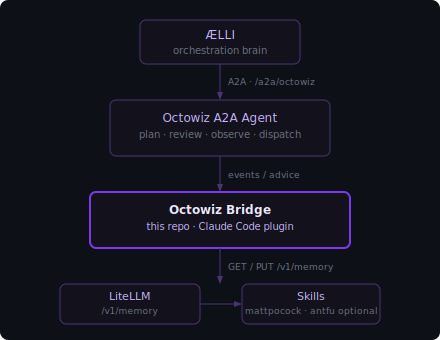
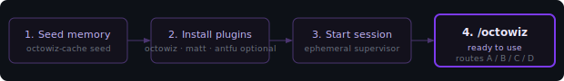
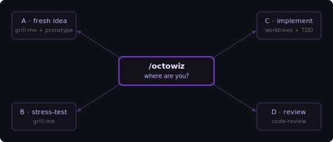

<div align="center">


# octowiz

**Octowiz Bridge** — the Claude Code adapter for the Octowiz Engineering Agent.

[](LICENSE)


[**Live overview ↗**](https://raelli.github.io/octowiz/) &nbsp;·&nbsp; [ÆLLI — orchestration brain](https://github.com/raelli/aelli) &nbsp;·&nbsp; [Install](#setup) &nbsp;·&nbsp; [Diagnostics](#diagnostics)

[Architecture](#architecture) &nbsp;·&nbsp; [Setup](#setup) &nbsp;·&nbsp; [Using /octowiz](#using-octowiz) &nbsp;·&nbsp; [Reference](#reference)

</div>

---

## Why this exists

Most AI coding tools give agents either a giant system prompt or nothing. Octowiz takes a third path: doctrine lives in a memory store, agents fetch only what is relevant to their current phase, and the coordinator skill routes to purpose-built skill libraries rather than trying to be everything itself.

---

## Architecture



### Components

| Name | What it is |
|---|---|
| **ÆLLI** | The orchestration brain ([raelli/aelli](https://github.com/raelli/aelli)). Hosts all A2A agents listed below. Makes strategic decisions and delegates coding work via A2A. |
| **Octowiz Bridge** | This repo. The Claude Code plugin. Connects developer sessions to ÆLLI, routes to skills, seeds project memory. Install name: `octowiz`. |
| **LiteLLM** | Platform layer. A2A gateway, Memory API, and IntegraHub Marketplace. |

### A2A agents

All agents live in [raelli/aelli](https://github.com/raelli/aelli) and are registered in LiteLLM as the gateway layer.

| LiteLLM name | AELLI endpoint | Description |
|---|---|---|
| `aelli-orchestrator` | `/a2a/aelli` | Routes natural language requests to specialist agents via tool_use |
| `aelli-router` | `/a2a/aelli-router` | Multi-router dispatch — coding vs Nemotron; runs generate/review/revise workflows |
| `aelli-octowiz` | `/a2a/octowiz` | Context packager for `octowiz.plan` and `octowiz.review`, scaled to model tier |
| `aelli-engineering` | `/a2a/engineering` | Answers questions from indexed GitHub, Confluence, and Jira content |
| `aelli-dev-advisor` | `/a2a/dev-advisor` | Monitors cross-session file conflicts, branch drift, and spec deviations |

### Memory namespaces

| Prefix | Count | What it contains |
|---|:--:|---|
| `playbook:*` | **17** | Workflow doctrine: how to plan, slice, implement, review, and ship. Covers context management, alignment interviews, PRD structure, tracer-bullet slicing, HITL vs AFK, TDD, fresh-context review, deep modules, frontend prototypes, parallel agents, and more. |
| `skills:*` | **3** | Routing summaries for the two upstream skill libraries (mattpocock/skills, obra/superpowers) and the marketplace skills hub. |
| `agent:{role}:*` | **4** | Role-specific memory slices for `planner`, `implementer`, `reviewer`, and `qa`. Each agent pulls only its own slice. |
| `config:*` | **2** | Import guidance and the retrieval contract the coordinator reads on startup. |

Memory keys follow the pattern:

```text
team:allspark:playbook:ai-coding-workflow:*   shared doctrine
team:allspark:skills:*                        external skill routing
agent:{role}:memory:ai-coding-workflow        role-specific
project:allspark:config:*                     import / namespacing
```

`allspark` is the example namespace. Replace it with your own project slug when forking.

---

## Setup



Four steps to a working `/octowiz`.

### 1. Seed memory into LiteLLM

The workflow doctrine lives in LiteLLM's `/v1/memory` store. Use `octowiz-cache seed` to populate it for your project.

Set your LiteLLM endpoint and key:

```bash
export LITELLM_BASE_URL="https://your-proxy.example.com"
export LITELLM_ADMIN_API_KEY="sk-..."
```

Seed the project namespace (idempotent — safe to rerun):

```bash
octowiz-cache seed
```

Or seed with an explicit project slug:

```bash
octowiz-cache seed --project my-project
```

Confirm the seed landed:

```bash
curl "$LITELLM_BASE_URL/v1/memory/team%3Aallspark%3Askills%3Amatt-pocock%3Aai-engineering" \
  -H "Authorization: Bearer $LITELLM_ADMIN_API_KEY"
```

Or fetch a whole prefix:

```bash
curl "$LITELLM_BASE_URL/v1/memory?key_prefix=team:allspark:playbook:ai-coding-workflow:" \
  -H "Authorization: Bearer $LITELLM_ADMIN_API_KEY"
```

Team-scoped writes under `team:allspark:*` require proxy-admin scope. The commands above read `LITELLM_ADMIN_API_KEY` first and fall back to `LITELLM_API_KEY`.

### 2. Install the Claude Code plugins

Add the IntegraHub marketplace to `~/.claude/settings.json`:

```json
{
  "extraKnownMarketplaces": {
    "integrahub": {
      "source": "url",
      "url": "https://llm.integrahub.de/claude-code/marketplace.json"
    }
  },
  "env": {
    "LITELLM_BASE_URL": "https://your-proxy.example.com",
    "LITELLM_API_KEY": "sk-..."
  }
}
```

Then open Claude Code and run `/plugins` to install the three required plugins:

| Plugin | Provides |
|---|---|
| `octowiz` | The `/octowiz` coordinator skill (this repo) |
| `mattpocock-skills` | Alignment, PRD, TDD, diagnosis, architecture, handoff skills |
| `superpowers` | Brainstorming, plans, worktrees, subagents, review, verification skills |

All three are required. `/octowiz` routes to skills from the other two — if either is missing the coordinator will fail mid-flow.

### 3. Start the daemon

The Octowiz daemon is a Node.js service that runs per machine. It connects the Claude Code hooks to the AELLI A2A network and handles capability dispatch.

```bash
pnpm start
```

Or directly:

```bash
node index.js
```

The Claude Code hooks (SessionStart, PostToolUse, UserPromptSubmit, Stop) fire automatically once the plugin is installed. They do not manage the daemon lifecycle.

#### Env vars

| Var | Purpose |
|---|---|
| `OCTOWIZ_ALLOWED_ROOTS` | **Required.** Colon-separated list of repo root paths the daemon is allowed to serve (e.g. `/Users/me/projects/myrepo`). The daemon exits on startup if this is unset or empty. |
| `AELLI_BASE_URL` | AELLI server base URL |
| `OCTOWIZ_A2A_URL` | Direct A2A server URL override |
| `OCTOWIZ_A2A_PORT` | A2A server port (default: 8765) |
| `OCTOWIZ_DISPATCH_TIMEOUT` | Seconds before capability dispatch times out |
| `OCTOWIZ_INBOUND_SECRET` | Shared secret for inbound hook verification |

For memory and doctrine configuration, set these in `~/.claude/settings.json` under `env`:

| Var | Default | Purpose |
|---|---|---|
| `LITELLM_BASE_URL` | — | LiteLLM proxy URL for memory retrieval |
| `LITELLM_API_KEY` | — | API key for memory reads |
| `OCTOWIZ_NAMESPACE` | `allspark` | Memory namespace |
| `OCTOWIZ_CACHE_DIR` | `~/.cache/octowiz` | Doctrine cache root |
| `OCTOWIZ_CACHE_TTL_SECONDS` | `3600` | Bundle revalidation interval |
| `OCTOWIZ_CACHE_BYPASS` | — | Set to `1` to skip cache entirely |

### 4. Run /octowiz

Open any repo in Claude Code and invoke the coordinator:

```text
/octowiz
```

The coordinator reads your project setup, fetches the relevant doctrine from LiteLLM, and routes you to the right workflow.

Run `/mattpocock-skills:setup-matt-pocock-skills` once per repo before first use to wire your issue tracker and domain docs.

---

## Using /octowiz



After the pre-flight check, the coordinator asks where you're starting from:

| Option | Starting point | Entry skill |
|---|---|---|
| A | Fresh idea | `brainstorming` |
| B | Have a plan to stress-test | `grill-me` |
| C | Ready to implement | `using-git-worktrees` + TDD |
| D | Code done, need review | `zoom-out` + `requesting-code-review` |

### What happens when you run /octowiz

1. **Project state is read** — CLAUDE.md, README, open issues, current branch, git log.
2. **Routing doctrine is loaded** — `octowiz-cache get --role routing` fetches the cached retrieval contract. If the cache is cold it pulls from LiteLLM. If LiteLLM is unreachable and the cache is stale, it serves the stale bundle with a warning.
3. **You choose a starting point** — A, B, C, or D. The coordinator suggests a default based on project state (open issues + active branch → C; no plan → A).
4. **A role bundle is prepended to context** — planner doctrine for A/B, implementer for C, reviewer for D. Stable rules land early in the context window.
5. **Fresh project context is appended** — git status, open issues, your request. Never cached.
6. **The first skill in the chosen path is invoked.**

### Retrieval per role

Each role pulls only its slice of the doctrine pack:

| Role | Memories fetched |
|---|---|
| **Planner** | `overview`, `grill-me-alignment`, `prd-destination-document`, `kanban-tracer-bullets`, `skill-sources`, `agent:planner:*` |
| **Implementer** | `context-smart-zone`, `tdd-feedback-loops`, `ralph-loop`, `skills:matt-pocock:*`, `skills:obra-superpowers:*`, `agent:implementer:*` |
| **Reviewer** | `fresh-context-review`, `push-pull-standards`, `skills:obra-superpowers:*`, `agent:reviewer:*` |
| **QA** | `manual-qa-taste`, `frontend-prototypes`, `agent:qa:*` |

### Skill routing

Octowiz routes to two upstream skill libraries rather than vendoring them:

**[mattpocock/skills](https://github.com/mattpocock/skills)** — alignment interviews, PRD generation, vertical slicing, TDD, debugging, architecture improvement, prototyping, handoff. Best fit when a task starts loose and needs structure.

**[obra/superpowers](https://github.com/obra/superpowers)** — brainstorming before code, written plans, git worktrees, subagent-driven development, systematic debugging, code review, verification before completion, finishing branches. Best fit when you want a strict end-to-end methodology.

Neither is bundled. Forks should keep routing entries pointing at the real upstream so attribution and updates stay intact.

### Skills in this plugin

| Slash command | Purpose |
|---|---|
| `/octowiz` | Coordinator — reads project state, loads doctrine, routes A/B/C/D |
| `/octowiz:setup` | Environment setup wizard — detects gaps (plugins, LiteLLM, memory), fixes them interactively |
| `/octowiz:octowiz-doctowiz` | Doctor — full multi-mode diagnostic for the octowiz + AELLI integration stack |

---

## Reference

### A2A capabilities

When AELLI dispatches a task to Octowiz via `/a2a/octowiz`, the daemon routes it to the matching capability handler. All capabilities are pull-based — the daemon polls the task queue and executes locally inside the developer's Claude Code session.

| Capability | Description |
|---|---|
| `octowiz.plan` | Generate an implementation plan for a given task description |
| `octowiz.review` | Review a diff or file set and return structured findings |
| `octowiz.dispatch` | Dispatch a Claude Code background session for an autonomous task |
| `octowiz.run_sandboxed` | Execute a task inside an isolated Sandcastle container |
| `octowiz.manage_agents` | List, start, stop, and inspect active Claude Code agents |
| `octowiz.marketplace_info` | Query the IntegraHub Marketplace for available skills, plugins, and agents |
| `octowiz.load_memory` | Fetch and return a memory bundle for the current session |
| `octowiz.escalate_to_aelli` | Escalate a decision or blocker to ÆLLI for strategic resolution |
| `octowiz.write_diary` | Write a session diary entry (observations, decisions, outcomes) |

`/a2a/dev-advisor` is a compatibility alias for `/a2a/octowiz`, maintained while older clients migrate.

### Memory caching

Octowiz caches stable doctrine bundles locally so repeated `/octowiz` runs load instantly without hitting LiteLLM on every invoke. Only stable doctrine is cached — git status, source files, test output, open issues, user requests, and review conclusions are never cached.

```bash
octowiz-cache get --role planner      # fetch planner bundle (from cache or LiteLLM)
octowiz-cache build --all             # warm all role bundles
octowiz-cache status                  # check freshness at a glance
octowiz-cache refresh --all           # force-rebuild from LiteLLM
octowiz-cache clear                   # delete cache for current namespace
octowiz-cache clear --all-namespaces  # wipe entire cache
octowiz-cache seed                    # seed project namespace into LiteLLM Memory
octowiz-cache check                   # environment health check
octowiz-cache init                    # bootstrap missing state files
```

If the cache is stale and LiteLLM is unreachable, `octowiz-cache` serves the stale bundle with a stderr warning rather than failing. If no cached bundle exists at all, it falls back to built-in routing.

| Variable | Default | Purpose |
|---|---|---|
| `OCTOWIZ_CACHE_DIR` | `~/.cache/octowiz` | Cache root directory |
| `OCTOWIZ_CACHE_TTL_SECONDS` | `3600` | Seconds before revalidation |
| `OCTOWIZ_CACHE_BYPASS` | — | Set to `1` to skip cache entirely |
| `OCTOWIZ_NAMESPACE` | `allspark` | Namespace for memory key substitution |

### Sandcastle — sandboxed execution

`octowiz.run_sandboxed` runs tasks inside a Docker/Podman container built from the official Octowiz sandbox image. The container has `node 22`, `git`, and the `claude` CLI pre-installed. No credentials are baked into the image — secrets are forwarded via name-only `--env` flags at runtime.

**Container image:** `ghcr.io/raelli/octowiz-sandbox:latest`

Built on `node:22-bookworm-slim`. Automatically rebuilt on every push to `containers/sandcastle/**` via GitHub Actions.

Build locally:

```bash
make build-sandbox-image
```

| Var | Purpose |
|---|---|
| `ANTHROPIC_API_KEY` | Required for `claude` CLI inside the container |
| `ANTHROPIC_BASE_URL` | Optional — override the Anthropic API endpoint |
| `AELLI_AUTH_TOKEN` | Forward-looking — for future hooks inside the container |

### Marketplace integration

Octowiz publishes itself to the IntegraHub Marketplace and can query it via the `octowiz.marketplace_info` capability.

```bash
# List all marketplace items
python -m packages.marketplace_client.cli discover

# Resolve a specific item by name
python -m packages.marketplace_client.cli resolve octowiz
```

Keep `octowiz-marketplace-manifest.json` in sync with `package.json` version and the capability list when shipping a new release.

### Diagnostics

Run the Doctowiz skill for a full integration health check at any time:

```text
/octowiz:octowiz-doctowiz
```

Doctowiz probes each layer in sequence: Claude Code plugin version, env vars, hook pipeline, LiteLLM connectivity, AELLI reachability, daemon status, and memory bundles. It reports a pass/fail table per check and suggests targeted fixes for anything red.

Run the underlying script directly for a quick terminal check:

```bash
node "$CLAUDE_PLUGIN_ROOT/apps/doctowiz/index.js"
```

### Security

- `LITELLM_ADMIN_API_KEY` is only needed when memory writes require elevated scope; read operations work with a standard `LITELLM_API_KEY`.
- The sandbox container image contains no credentials. Secrets are forwarded at container start time via name-only `--env VAR` flags — the value is read from the host environment by Docker/Podman and never enters `argv` or logs.
- `OCTOWIZ_INBOUND_SECRET` is a shared secret used to verify inbound hook events from Claude Code.
- The daemon enforces an allowlist on incoming task roots to prevent dispatching outside declared project paths.

---

## Attribution

Sources this pack draws from:

- **["Essential Skills for AI Coding from Planning to Production"](https://www.youtube.com/watch?v=-QFHIoCo-Ko)** — Matt Pocock's workshop at AI Engineer. The workflow doctrine in this pack is distilled from it.
- [mattpocock/skills](https://github.com/mattpocock/skills) — Matt Pocock
- [obra/superpowers](https://github.com/obra/superpowers) — Jesse Vincent / Prime Radiant

The two skill libraries aren't bundled. Octowiz stores compact routing summaries that send agents to the right place when the current task calls for it.

## License

MIT. See [`LICENSE`](LICENSE).

<div align="center">

—

**[octowiz](https://github.com/raelli/octowiz)** &nbsp;·&nbsp; part of the **IntegraHub** engineering ecosystem &nbsp;·&nbsp; [ÆLLI ↗](https://github.com/raelli/aelli)

</div>
